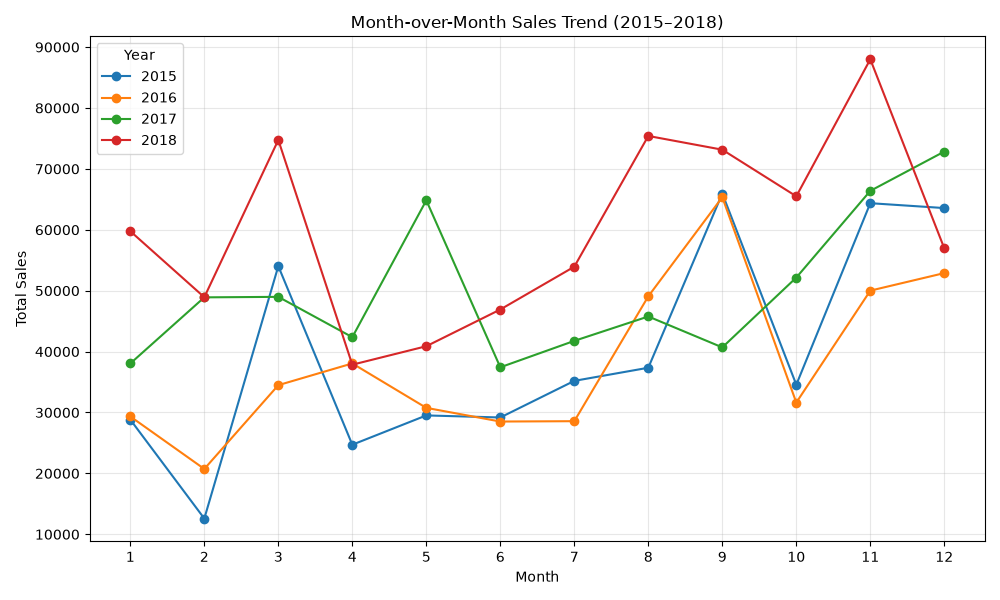
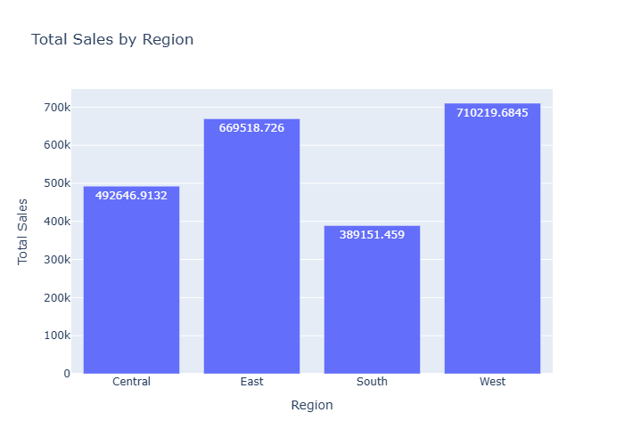
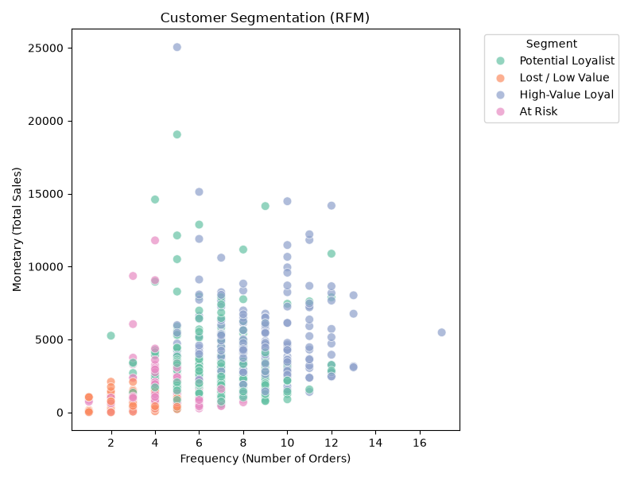
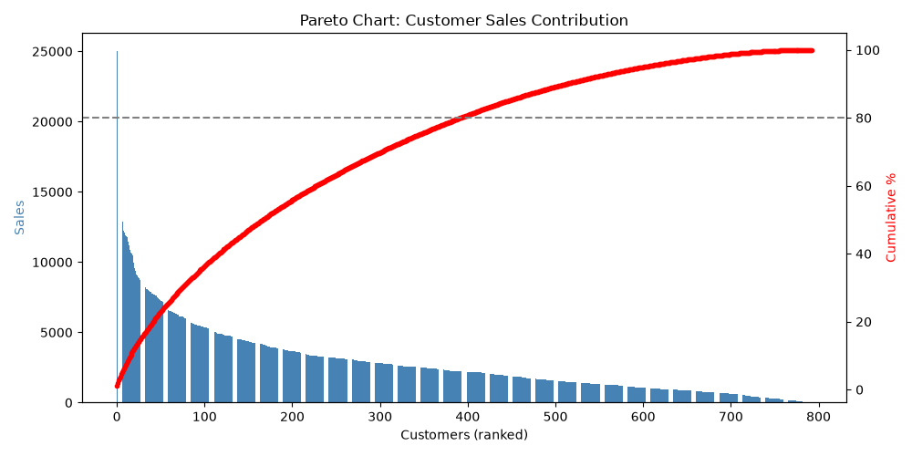

# 🛒 Superstore Sales Analysis — EDA to Power BI Dashboard

An end-to-end sales analytics project on the **Superstore dataset** (2015–2018), covering data cleaning, exploratory data analysis in Python, and an interactive Power BI dashboard — turning **9,800 order line items** into actionable business insights.

---

## 🧭 Project Workflow

```
Raw Data → Data Cleaning → EDA (Python) → Power BI Dashboard → Insights & Report
```

| Stage | Tool | Output |
|---|---|---|
| Data Cleaning & EDA | Python (Pandas, Matplotlib/Seaborn) | Charts, trends, segmentation |
| Business Intelligence | Power BI | Interactive dashboard |
| Reporting | Markdown / Word | Findings & recommendations |

---

## 📈 Exploratory Data Analysis (EDA)

Comprehensive EDA was performed using Python to uncover sales trends, customer behavior, and business opportunities across **4,922 unique orders**.

---

### 📊 Month-over-Month Sales Trend (2015–2018)

<p align="center">
  
</p>

Monthly sales fluctuate across all four years, with a consistent seasonal pattern — demand builds steadily through the year and peaks sharply in the final quarter (September, November–December), driven by back-to-school and holiday buying cycles.

---

### 🌍 Regional Sales Analysis

<p align="center">
  
</p>

The **West** and **East** regions generate the highest revenue, together contributing over 60% of total sales, while the **South** region records the lowest — highlighting an opportunity to investigate under-penetrated markets.

---

### 👥 Customer Segmentation (RFM Analysis)

<p align="center">
  
</p>

Customers were segmented using **Recency, Frequency, and Monetary (RFM)** analysis to distinguish high-value loyal customers, potential loyalists, and at-risk customers — enabling targeted retention and re-engagement strategies.

---

### 📈 Pareto Analysis (80/20 Rule)

<p align="center">
  
</p>

The Pareto chart confirms the classic 80/20 pattern: a relatively small share of customers drives a disproportionately large share of total revenue, pinpointing exactly which segment the business should prioritize for retention.

---

## 📊 Interactive Power BI Dashboard

The findings from the EDA stage were translated into a fully interactive Power BI dashboard, giving stakeholders a self-service tool to explore sales performance without writing a single line of code.

### Dashboard Preview

<p align="center">
  
</p>

### Dashboard Features

- 📌 Total Sales KPI (**$2.26M**)
- 📌 Total Orders KPI (**4,922**)
- 📈 Monthly & Yearly Sales Trends
- 📊 Sales by Category & Sub-Category
- 👥 Customer Segment Breakdown
- 🌍 Region & State-wise Sales Analysis
- 🚚 Shipping Mode Analysis
- 🎯 Interactive Region Slicer for on-the-fly filtering

📥 [Download the Power BI file](PowerBI/supersales_store_data_analysis.pbix)

---

## 🔑 Key Insights

| Insight | Detail |
|---|---|
| 🏆 Top Category | **Technology** — highest revenue despite fewest line items (highest avg. order value) |
| 👥 Largest Segment | **Consumer** — ~51% of total sales |
| 📍 Top State | **California** — $446K+ in sales, followed by New York |
| 🚚 Most Used Shipping | **Standard Class** — 60% of all orders, but slowest avg. delivery (5 days) |
| 📅 Seasonality | Sales peak **September–December** every year |
| 📈 YoY Growth | Steady growth from 2015 → 2018, with 2018 up **20.3%** over 2017 |
| 🎯 Pareto Effect | A small % of customers drive a large share of revenue — ideal loyalty-program targets |

---

## 🗂️ Repository Structure

```
├── data/                          # Cleaned dataset
├── notebooks/                     # EDA notebooks (Python)
├── charts/                        # Exported EDA visualizations
│   ├── monthly_sales_trend.png
│   ├── region_sales.png
│   ├── rfm_segmentation.png
│   └── pareto_chart.png
├── PowerBI/
│   ├── supersales_store_data_analysis.pbix
│   └── dashboard.png
├── Superstore_Sales_Analysis_Report.docx   # Final written report
└── README.md
```

---

## 🛠️ Tech Stack

`Python` · `Pandas` · `Matplotlib` / `Seaborn` · `Power BI` · `DAX`

---

## 🚀 How to Reproduce

1. Clone this repo: `git clone <repo-url>`
2. Install dependencies: `pip install -r requirements.txt`
3. Run the EDA notebooks in `notebooks/` to regenerate the charts
4. Open `PowerBI/supersales_store_data_analysis.pbix` in Power BI Desktop to explore the dashboard interactively

---

## 📄 Full Report

For the complete written analysis with detailed breakdowns, recommendations, and methodology, see [Superstore_Sales_Analysis_Report.docx](Superstore_Sales_Analysis_Report.docx).

---

⭐ If you found this project useful, consider giving it a star!